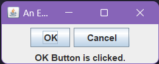

 # Event Demo

This is a simple Java program that demonstrates the event handling mechanism of swing using two buttons and a label

## Step-by-Step Explanation

### 1. Import the necessary packages

```java
import javax.swing.*;
import java.awt.*;
import java.awt.event.*;
```

This line imports the Swing package, which contains the classes and interfaces needed to create graphical user interfaces (GUIs) in Java.

### 2. Create a JFrame

```java
JFrame jfrm = new JFrame("An Event example");
```

This line creates a new JFrame object, which is the main window of a Swing application. The title of the frame is set to "An Event example".

### 3. Set the size of the JFrame

```java
jfrm.setSize(220, 90);
```

This line sets the size of the JFrame to 220 pixels wide and 90 pixels high.

### 4. Set the default close operation for the JFrame

```java
jfrm.setDefaultCloseOperation(JFrame.EXIT_ON_CLOSE);
```

This line sets the default close operation for the JFrame to EXIT_ON_CLOSE, which means that the application will exit when the user clicks the close button on the frame.

### 5. Create two JButtons

```java
// Create an OK button
    JButton jbtOK = new JButton("OK");
        
// Create a Cancel button
    JButton jbtCancel = new JButton("Cancel");
```

These lines creates an OK button and a Cancel button using JButton class.

### 6. Adding and implementing Action Listeners

```java
    jbtOK.addActionListener(new ActionListener() {
            public void actionPerformed(ActionEvent e) {
                jlab.setText("OK Button is clicked.");
            }
        });
    jbtCancel.addActionListener(new ActionListener() {
            public void actionPerformed(ActionEvent e) {
                jlab.setText("Cancel Button is clicked.");
            }
        });
```

These lines add Action Listeners to the buttons that implements the one and only one method in the ActionListener interface *actionPerformed* and then sets the label to show a specific text as message

### 7. Add the Button to the Frame

```java
jfrm.add(jbtOK);
jfrm.add(jbtCancel);
```

These lines add the buttons to the JFrame

### 8. Initialize the label and add it to Frame

```java
jlab = new JLabel("Press a button!");
jfrm.add(jlab);
```

These lines initialisez the label with a text and then displays adds the label to fram


### 9. Make the JFrame visible

```java
jfrm.setVisible(true);
```

This line makes the JFrame visible on the screen.

### 8. Schedule a job for the event-dispatching thread

```java
SwingUtilities.invokeLater(new Runnable() {
    public void run() {
        new EventDemo();
    }
});
```

This line schedules a job for the event-dispatching thread, which is responsible for handling all GUI events. The job is to create a new instance of the EventDemo class.

## Conclusion

This is a simple example of how to setup Event Handling using Swing package. 

## Output

The Output of the program may look like this
