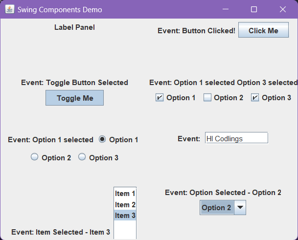

# Swing Components Demo

This is a program written to demonstrate different components in Swing package. 

## Components used

- [`JFrame`]( #jframe-creation-and-setting-properties )
- [`JLabel`]( #1-label-panel )
- [`JButton`]( #2-button-panel )
- [`JToggleButton`]( #3-toggle-button-panel )
- [`JCheckBox`]( #4-check-box-panel )
- [`JRadioButton`]( #5-radio-button-panel )
- [`JTextField`]( #6-text-field-panel )
- [`JList`]( #7-list-panel )
- [`JComboBox`]( #8-combobox-panel )


## Step by Step explanation

### Importing Packages

```java
import javax.swing.*;
import java.awt.*;
import java.awt.event.*;
import javax.swing.event.*;
```

Every required package is imported<br>
The `swing` and `awt` packages are imported for the components and their `event` subclasses has been imported to implement there events and perform necessary action.

### Creating the constructor

```java
SwingComponentsDemo() {
    //app body
    ...
}
```

The `SwingComponentDemo` constructor is used in the main method of the class to start the app

### JFrame creation and setting properties

```java
JFrame frame = new JFrame("Swing Components Demo");
frame.setDefaultCloseOperation(JFrame.EXIT_ON_CLOSE);
```

A `JFrame` object named "frame" is created with title as "Swing Components Demo". The default close operation is set to exit.

### Function calls for creating Panels for different components

```java
//panel for JLabel
JPanel labelPanel = createLabelPanel("Label Panel");
//panel for JButton
JPanel buttonPanel = createButtonPanel("Button Panel");
//panel for JToggleButton
JPanel toggleButtonPanel = createToggleButtonPanel("Toggle Button Panel");
//panel for JCheckbox
JPanel checkBoxPanel = createCheckBoxPanel("Checkbox Panel");
//panel for JRadioButton
JPanel radioButtonPanel = createRadioButtonPanel("Radio Button Panel");
//panel for JTextField
JPanel textFieldPanel = createTextFieldPanel("Text Field Panel");
//panel for JList
JPanel listPanel = createListPanel("List Panel");
//panle for JComboBox
JPanel comboBoxPanel = createComboBoxPanel("Combo Box Panel");
```

These panels are created using methods that will be explained later on.<br><br>

### Setting a Layout for the Frame

```java
frame.setLayout(new GridLayout(4, 2));
```

A `GridLayout` with 4 rows and 2 columns is set as the layout manager for the `JFrame`.

### Adding panels to the frame's content pane

```java
frame.add(labelPanel);
frame.add(buttonPanel);
frame.add(toggleButtonPanel);
frame.add(checkBoxPanel);
frame.add(radioButtonPanel);
frame.add(textFieldPanel);
frame.add(listPanel);
frame.add(comboBoxPanel);
```

Each panel is added to the `contentPane` of the `JFrame`, so they appear side by side below each other.

### Setting preferred size for all panels

```java
frame.setSize(500, 400);
```

The `preferredSize` property of each panel is set to `(500, 400)`.

### Setting the Frame to be visible

```java
frame.setVisible(true);
```

Finally, the visibility of the `JFrame` is set to true, making it visible on the screen.
<hr>

## Methods for Creating Panels

All these methods return an instance of `JPanel`. Each method creates a specific type of component.

### 1. Label Panel

Creates a `JLabel` in the center of the panel. The text "This is a label" appears next to the label.
```java
private JPanel createLabelPanel(String panelName) {
    JPanel panel = new JPanel();
    JLabel label = new JLabel(panelName);
    panel.add(label);
    return panel;
}
```
---

### 2. Button Panel

Creates two buttons: `Button 1` and `Button 2`. When either button is clicked, a label with the corresponding button shows the event output.

```java
private JPanel createButtonPanel(String panelName) {
    JPanel panel = new JPanel();
    JLabel label = new JLabel("Event: ");
    JButton button = new JButton("Click Me");
    button.addActionListener(new ActionListener() {
        @Override
        public void actionPerformed(ActionEvent e) {
            label.setText("Event: Button Clicked!");
        }
    });
    panel.add(label);
    panel.add(button);
    return panel;
}
```

An `ActionListener` is registered to the button to track an `ActionEvent` which changes the text in label using `setText()` method.

```java
button.addActionListener(new ActionListener() {
    @Override
    public void actionPerformed(ActionEvent e) {
        label.setText("Event: Button Clicked!");
    }
});
```

The `actionPerformed()` method inside the anonymous class is called when the button is clicked. It changes the text of the associated `JLabel`. <br>
Adding multiple listeners to one component will cause each listener to be called when the event occurs.

---
### 3. Toggle Button Panel
A toggle button can be created using `JToggleButton`. When clicked, it toggles between its selected and unselected states.

`JToggleButton` extends `JButton`, but it can be toggled on and off by clicking on it.
When a toggle button is clicked, it becomes selected (true), otherwise it's deselected (false).
```java
private JPanel createToggleButtonPanel(String panelName) {
    JPanel panel = new JPanel();
    JLabel label = new JLabel("Event: ");
    JToggleButton toggleButton = new JToggleButton("Toggle Me");
    toggleButton.addItemListener(new ItemListener() {
        @Override
        public void itemStateChanged(ItemEvent e) {
            if (toggleButton.isSelected()) {
                label.setText("Event: Toggle Button Selected");
            } else {
                label.setText("Event: Toggle Button Deselected");
            }
        }
    });
    panel.add(label);
    panel.add(toggleButton);
    return panel;
}
```
The `stateChanged` method of an `ItemListener` is invoked only when there is a change in the state of the item.
```java
toggleButton.addItemListener(new ItemListener() {
    @Override
    public void itemStateChanged(ItemEvent e) {
        if (toggleButton.isSelected()) {
            label.setText("Event: Toggle Button Selected");
        } else {
            label.setText("Event: Toggle Button Deselected");
        }
    }
});
```
The code above uses an anonymous inner class for the `itemStateChanged()` method.
This approach allows you to handle events without having to define a separate class.
However, using an anonymous inner class has some limitations. For example, you cannot access **local variables** from outside of the scope where they were declared.
You only need to implement the methods that are relevant to your application.<br>
If the button was added to more than one place, all of them would receive the same event.
To avoid this, you could use the `getSource()` method inside the handler.
However, since there is no risk of confusion with a single button, using an anonymous inner class simplifies the code.
However, since there will only ever be one toggle button named "Toggle Me", it doesn't matter which instance triggered the event.

---

### 4. Check Box panel

A `CheckBox` is similar to a toggle button, except that it doesn’t cycle through states when clicked.Instead, it remains in the “on” state until explicitly turned off. It display as a box which can be ticked in.When a check box is checked (`selected`), its state is true. Otherwise, it's false.

```java
private JPanel createCheckBoxPanel(String panelName) {
    JPanel panel = new JPanel();
    JLabel label = new JLabel("Event: ");
    JCheckBox checkBox1 = new JCheckBox("Option 1");
    JCheckBox checkBox2 = new JCheckBox("Option 2");
    JCheckBox checkBox3 = new JCheckBox("Option 3");
    ItemListener checkBoxListener = new ItemListener() {
        @Override
        public void itemStateChanged(ItemEvent e) {
            String eventText = "Event: ";
            if (checkBox1.isSelected()) {
                eventText += "Option 1 selected ";
            }
            if (checkBox2.isSelected()) {
                eventText += "Option 2 selected ";
            }
            if (checkBox3.isSelected()) {
                eventText += "Option 3 selected";
            }
            label.setText(eventText);
        }
    };
    checkBox1.addItemListener(checkBoxListener);
    checkBox2.addItemListener(checkBoxListener);
    checkBox3.addItemListener(checkBoxListener);
    panel.add(label);
    panel.add(checkBox1);
    panel.add(checkBox2);
    panel.add(checkBox3);
    return panel;
}
```

In this example, we have created a checkbox panel with three options. When any option is checked or unchecked, it updates the text in the associated label. The `itemStateChanged` method is implemented such that it uses `isSelected()` method on each of the checkbox and then displays a text corresponding to that in the label.

#### Here the usage of anonymous class is excluded, instead the `itemStateChanged()` method is implemented with the instance creation of `ItemListener` and then it is added to every button

---

### 5. Radio Button panel
The logic is similar to checkboxes but we use radio buttons instead. We also need to make sure that only one button can be selected at a time, for this every button is added to a button group, an instance of `ButtonGroup` such that the button in a group are mutually exclusive.
```java
private JPanel createRadioButtonPanel(String panelName) {
    JPanel panel = new JPanel();
    JLabel label = new JLabel("Event: ");
    JRadioButton radioButton1 = new JRadioButton("Option 1");
    JRadioButton radioButton2 = new JRadioButton("Option 2");
    JRadioButton radioButton3 = new JRadioButton("Option 3");
    ButtonGroup buttonGroup = new ButtonGroup();
    buttonGroup.add(radioButton1);
    buttonGroup.add(radioButton2);
    buttonGroup.add(radioButton3);
    ItemListener radioButtonListener = new ItemListener() {
        @Override
        public void itemStateChanged(ItemEvent e) {
            if (radioButton1.isSelected()) {
                label.setText("Event: Option 1 selected");
            } else if (radioButton2.isSelected()) {
                label.setText("Event: Option 2 selected");
            } else if (radioButton3.isSelected()) {
                label.setText("Event: Option 3 selected");
            }
        }
    };
    radioButton1.addItemListener(radioButtonListener);
    radioButton2.addItemListener(radioButtonListener);
    radioButton3.addItemListener(radioButtonListener);
    panel.add(label);
    panel.add(radioButton1);
    panel.add(radioButton2);
    panel.add(radioButton3);
    return panel;
}
```

Here we have created a radio panel with three options and they are added with an `ItemListener` which implements the `itemStateChanged()` method by calling `isSelected()` method on every button to check if it is selected and processing the event.

```java
ItemListener radioButtonListener = new ItemListener() {
    @Override
    public void itemStateChanged(ItemEvent e) {
        if (radioButton1.isSelected()) {
            label.setText("Event: Option 1 selected");
        } else if (radioButton2.isSelected()) {
            label.setText("Event: Option 2 selected");
        } else if (radioButton3.isSelected()) {
            label.setText("Event: Option 3 selected");
        }
    }
};
```

This code adds an `ItemListener` to each of the three radio buttons, which means that when one of them is clicked or deselected.

---

### 6. Text Field Panel

There is one `JTextField` that is initially empty and send an `ActionEvent` when ENTER key is pressed. The text field has the listener which adds the entered value to a Label.

```java
    private JPanel createTextFieldPanel(String panelName) {
        JPanel panel = new JPanel();
        JLabel label = new JLabel("Event: ");
        JTextField textField = new JTextField(10);
        textField.addActionListener(new ActionListener() {
            @Override
            public void actionPerformed(ActionEvent e) {
                label.setText("Event: Text Entered - " + textField.getText());
            }
        });
        panel.add(label);
        panel.add(textField);
        return panel;
    }
```
Note that the `actionPerformed` method is called when the user presses enter in the field. The method is implemented in an anonymous class.
```java
textField.addActionListener(new ActionListener() {
    @Override
    public void actionPerformed(ActionEvent e) {
        label.setText("Event: Text Entered - " + textField.getText());
    }
});
```

`JTextComponent` is the superclass of all Swing text components, such as `JTextField`, `JTextArea`.

---
### 7. List Panel

`JList`: a component that displays a list of items from which the user can select an item. The selection in a `JList`.
The constructor for `JList` takes an array of objects that will be displayed in the list.
The `getSelectedItem()` method returns the currently selected object's value.
```java
private JPanel createListPanel(String panelName) {
    JPanel panel = new JPanel();
    JLabel label = new JLabel("Event: ");
    String[] data = {"Item 1", "Item 2", "Item 3"};
    JList<String> list = new JList<>(data);
    list.addListSelectionListener(new ListSelectionListener() {
        @Override
        public void valueChanged(ListSelectionEvent e) {
            label.setText("Event: Item Selected - " + list.getSelectedValue());
        }
    });
    panel.add(label);
    panel.add(new JScrollPane(list));
    return panel;
}
```
Note that `valueChanged(...)` is called whenever there is a change to the selection model ( e.g., if you click on another item in the list ).
The event handling is done using a `ListSelectionListener`.

```java
list.addListSelectionListener(new ListSelectionListener() {
    @Override
    public void valueChanged(ListSelectionEvent e) {
        label.setText("Event: Item Selected - " + list.getSelectedValue());
    }
});
```
Note that if multiple items are selected (via `Ctrl` or `Shift`), only one item can be reported as being selected at any given time.


---
### 8. ComboBox Panel
`JComboBox` displays a list of items from which the user can select an item.
The constructor for `JComboBox` takes an array of objects that will be displayed in the box.
The `getSelectedValue()` method returns the currently selected object.

```java
private JPanel createComboBoxPanel(String panelName) {
    JPanel panel = new JPanel();
    JLabel label = new JLabel("Event: ");
    String[] data = {"Option 1", "Option 2", "Option 3"};
    JComboBox<String> comboBox = new JComboBox<>(data);
    comboBox.addActionListener(new ActionListener() {
        @Override
        public void actionPerformed(ActionEvent e) {
            label.setText("Event: Option Selected - " + comboBox.getSelectedItem());
        }
    });
    panel.add(label);
    panel.add(comboBox);
    return panel;
}
```
Note that this example uses an `ActionListener`, not a `ListSelectionListener`, because `JComboBox` does not support multiple selection. And accepts an `ActionEvent`.
```java
comboBox.addActionListener(new ActionListener() {
    @Override
    public void actionPerformed(ActionEvent e) {
        label.setText("Event: Option Selected - " + comboBox.getSelectedItem());
    }
});
```
Note: The `actionPerformed()` method is called when the user selects an option or presses enter while the combobox has focus.


## Main method
The main method is written so as to run the app in an event dispatching thread.
```java
public static void main(String[] args) {
    SwingUtilities.invokeLater(new Runnable()  {
        public void run(){
            new SwingComponentsDemo();
        }
    });
}
```
This ensures that all Swing components are created and executed on the Event Dispatch Thread, avoiding any concurrency issues.

# Output



# Conclusion
This program was to provide an overview on components of swing package in java.